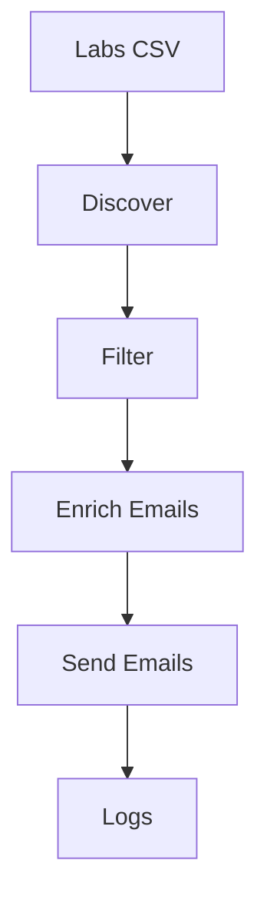

# ai_outreach_bot

Automates cold outreach to large-language-model (LLM) researchers. The pipeline discovers researchers, filters them via GPT, enriches contacts, and sends personalized emails.



## Quick Start

```bash
python -m venv .venv && source .venv/bin/activate
pip install -r requirements.txt
cp .env.example .env
python -m ai_outreach_bot discover --labs labs.csv
# review data/processed/researchers.csv
python -m ai_outreach_bot enrich
python -m ai_outreach_bot send
```

`labs.csv` sample:

```
lab_name,homepage_url,org_domain
Example Lab,https://example.edu,example.edu
```
